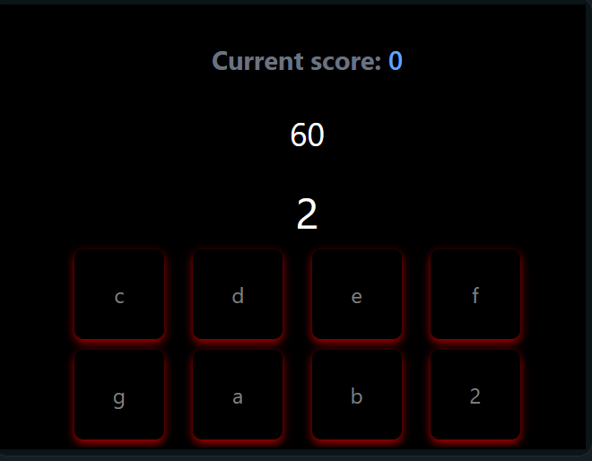

# Two Minute Music

## Basic Instructions

1. Start the game
2. Press the keys on your keyboard to play the notes
3. The game will continue until you the timer runs out
4. The final score will be displayed on the screen
5. Click the "Post Score on Reddit" button to post your score on Reddit (In development)

## Future Features

- [ ] Add a leaderboard to the game
- [ ] Add a way to post your score to Reddit
- [ ] Add different midi packs for different audio
- [ ] Change interface to be more user friendly
- [ ] Add a way to change the audio
- [ ] Add a way to change the difficulty
- [ ] Add a way to change the game mode
- [ ] Add a way to change the game speed
- [ ] Add a way to change the game length
- [ ] Add a way to change the game notes
- [ ] Add a way to customize audio and play songs

